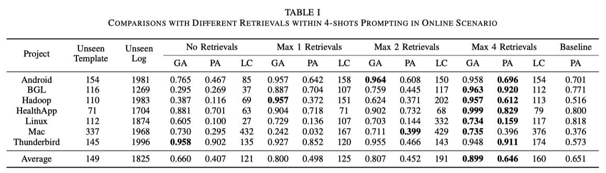

# Reliable Online Log Parsing using Large Language Models with Retrieval-Augmented Generation

This repository contains the implementation of the methods described in the paper *"Reliable Online Log Parsing using Large Language Models with Retrieval-Augmented Generation"*. The project aims to enhance the reliability and efficiency of log parsing using Large Language Models (LLMs) by incorporating retrieval-augmented generation techniques and regex-based template validation.

## Abstract

Software logs play a crucial role in the development and maintenance of large-scale software systems, recording essential runtime information. Log parsing, which converts log messages into structured templates, is fundamental for various automated analysis tasks such as anomaly detection and root cause analysis. Unlike traditional log parsing methods that struggle with accurately identifying variables, recent Large Language Models (LLMs)-based approaches leverage their in-context learning capabilities to achieve more precise variable identification. Nonetheless, LLMs require significant computational resources and often struggle with unseen data, rasing concerns about their reliability in real-world online scenarios. This study introduces a novel approach inspired by Retrieval-Augmented Generation to enhance the reliability and efficiency of LLM-based log parsing. The proposed method involves simple validation of generated templates through regex matching, incorporating contextually similar examples from a continuously updated template database into the LLM prompt. Experimental results demonstrate significant improvements in parsing performance, robustness to unseen data, and cost efficiency.

## Key Features

- **Semantic Template Generation**: The project includes a script to generate semantic templates from log messages using the OpenAI gpt4o-mini model.
- **Retrieval-Augmented Generation**: The log parsing pipeline uses a retrieval-augmented generation model to generate log templates with the Qdrant vector database. 
- **Regex-based Template Validation**: The generated templates are validated using regex patterns to ensure the reliability of the parsing results and reduce the number of false positives.

## Project Structure

```
.
├── evaluate.py                  # Script to evaluate the generated templates
├── evaluation/                  # Evaluation module from part of TA-Eval-Rep. (Copyright (C) 2022 University of Luxembourg)
├── experiment.sh                # Script to run experiments
├── gen_semantic.py              # Script to generate semantic templates
├── logs/                        # Apache logs dataset
├── analysis.ipynb               # Jupyter notebook for analysis
├── README.md                    # This README file
├── run.py                       # Main script to run the log parsing pipeline
└── utils.py                     # General utility functions
```

## Requirements

The project dependencies can be installed using the following `requirements.txt`:

```
pandas
numpy
scikit-learn
nltk
qdrant-client[fastembed]
openai
python-dotenv
rich
```

To install all required packages, run:

```bash
pip install -r requirements.txt
```

Additionally, you will need to run a Qdrant vector database. You can do so with the following Docker command:

```bash
sudo docker run -d --privileged -p 6333:6333 qdrant/qdrant
```

## How to Run

### Running the Experiment

The experiment can be executed using the provided `experiment.sh` script. This script will run the `gen_semantic.py` and `run.py` scripts in sequence for a given project.

```bash
./experiment.sh <project_name>
```

This will perform the following steps for the specified project:
1. Generate semantic templates with `gen_semantic.py`.
2. Run the log parsing pipeline with `run.py` using different configurations (0, 1, 2, and 4 retrievals).
3. Evaluate the results and generate output files.

## Results



The approach proposed in the paper for online log parsing with unseen data involves (i) providing the large language model (LLM) with examples similar to the input in the prompt, which significantly improves performance compared to using fixed examples, and (ii) leveraging regex-based pseudo-validation and a vector database to enable the system to achieve the same performance at less than 10% of the cost of the original LLM system.
